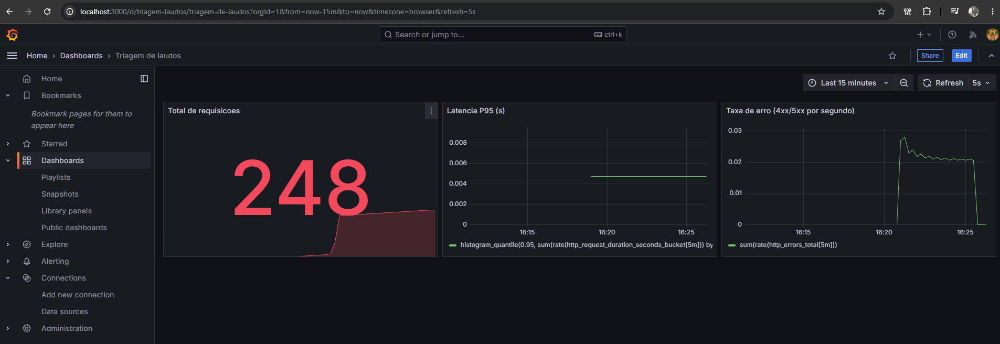
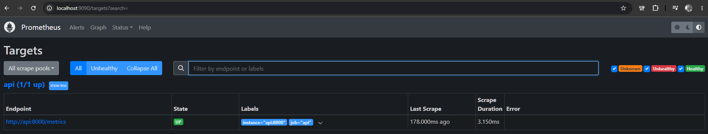

# Monitoramento — evidencias

Prints tirados com a stack no ar (`docker compose up --build -d api prometheus grafana`)
e trafego real gerado com `model/gerar_trafego.py`.

## Grafana — dashboard "Triagem de laudos"

3 paineis, populados com trafego real: total de requisicoes, latencia P95 e taxa de erro
(o pico de erro é esperado, o script manda uns 5% de texto vazio de proposito pra
testar o painel).

## Prometheus — target da API

Confirma o scrape em `http://api:8000/metrics`, target `UP`.

O dashboard tambem esta versionado como JSON em
[`monitoring/grafana/dashboards/triagem-laudos.json`](../monitoring/grafana/dashboards/triagem-laudos.json)
e sobe sozinho via provisionamento (nao precisa configurar nada na mao).
